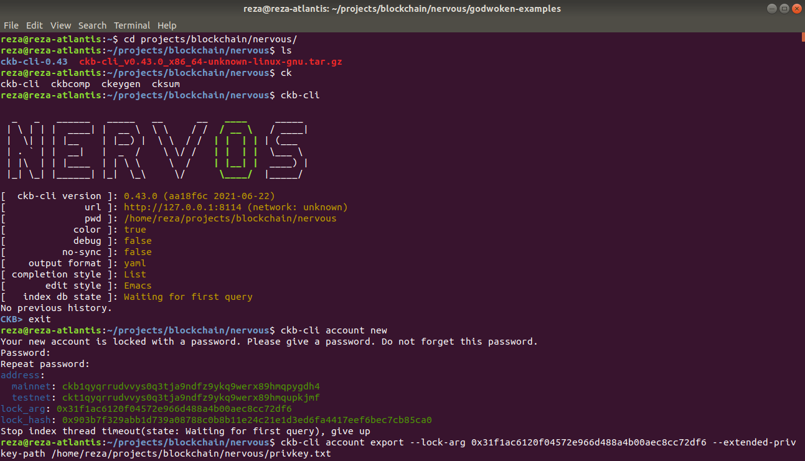
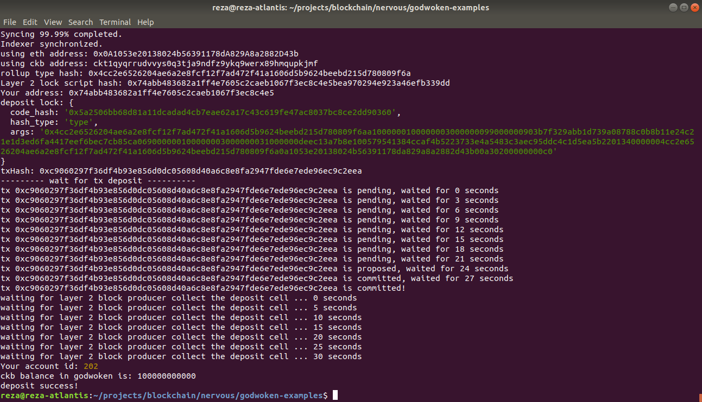

# Gitcoin: 1) Create a Godwoken Account on the EVM Layer 2 Testnet

## A screenshot of the accounts you created (account list) in ckb-cli

## A link to the Layer 1 address you funded on the Testnet Explorer
https://explorer.nervos.org/aggron/address/ckt1qyqrrudvvys0q3tja9ndfz9ykq9werx89hmqupkjmf

## A screenshot of the console output immediately after you have successfully submitted a deposit to Layer 2
