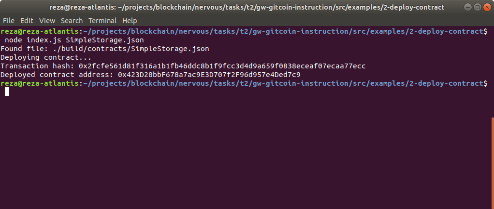

# Gitcoin: 2) Deploy a Simple Ethereum Smart Contract on Polyjuice

## 1. A screenshot of the console output immediately after you have successfully deployed a smart contract

## 2.The transaction hash from the contract deployment (in text format)
Transaction hash: `0x2fcfe561d81f316a1b1fb46ddc8b1f9fcc3d4d9a659f0838eceaf07ecaa77ecc`

## 3. 
Deployed contract address: `0x423D28bbF678a7ac9E3D707f2F96d957e4Ded7c9`
