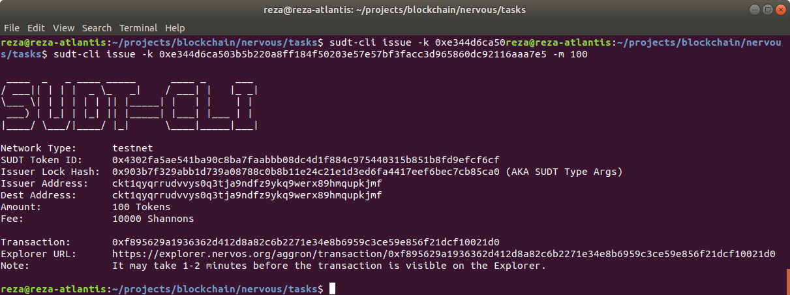
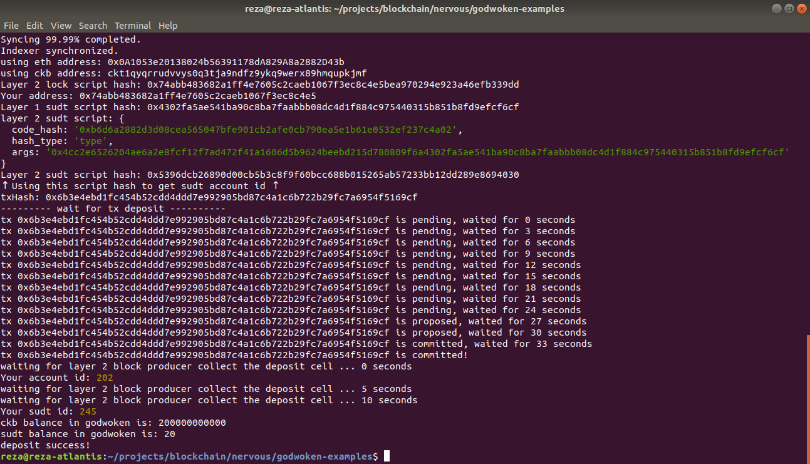

# Gitcoin: 4) Issue an SUDT Token on Layer 1 and Deposit it to Layer 2

## 1. A link to the Layer 1 address you funded on the Testnet Explorer
https://explorer.nervos.org/aggron/address/ckt1qyqrrudvvys0q3tja9ndfz9ykq9werx89hmqupkjmf

## 2. A screenshot of the console output immediately after using sudt-cli to create your SUDT tokens on Layer 1.

## 3. A link to the transaction ID created by sudt-cli on the Testnet Explorer.
https://explorer.nervos.org/aggron/transaction/0xf895629a1936362d412d8a82c6b2271e34e8b6959c3ce59e856f21dcf10021d0

## 4. A screenshot of the console output immediately after you have successfully submitted a deposit to Layer 2 using the account-cli tool.

## 5. The SUDT ID from the console output after executing the deposit script (in text format).
txHash: `0x6b3e4ebd1fc454b52cdd4ddd7e992905bd87c4a1c6b722b29fc7a6954f5169cf`  
Your sudt id: `245`  
ckb balance in godwoken is: `200000000000`  
sudt balance in godwoken is: `20`  

