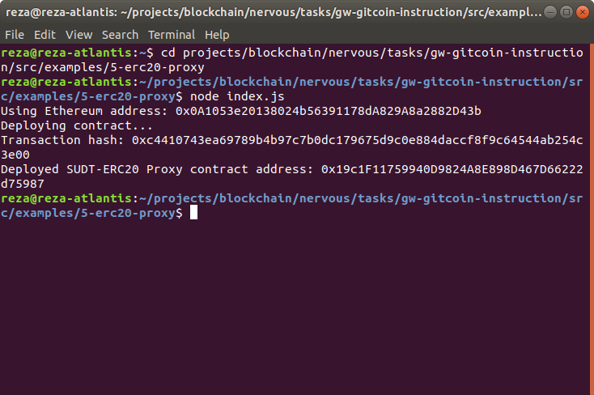
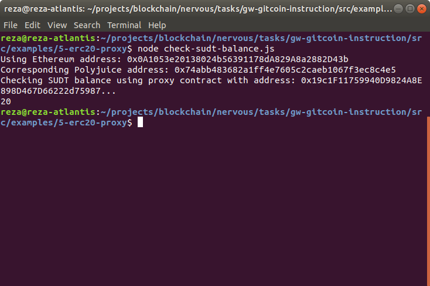

# Gitcoin: 5) Deploy the ERC20 Proxy Contract for the Deposited SUDT

## 1. A screenshot of the console output immediately after deploying smart contract.

## 2. The address of the ERC20 Proxy Contract you deployed (in text format).

Deployed SUDT-ERC20 Proxy contract address: `0x19c1F11759940D9824A8E898D467D66222d75987`

## 3. A screenshot of the console output immediately after checking your SUDT balance.

## 4. The Ethereum address that was checked (in text format).
Using Ethereum address: `0x0A1053e20138024b56391178dA829A8a2882D43b`  
Corresponding Polyjuice address: `0x74abb483682a1ff4e7605c2caeb1067f3ec8c4e5`  
Checking SUDT balance using proxy contract with address: `0x19c1F11759940D9824A8E898D467D66222d75987`...  
`20`

