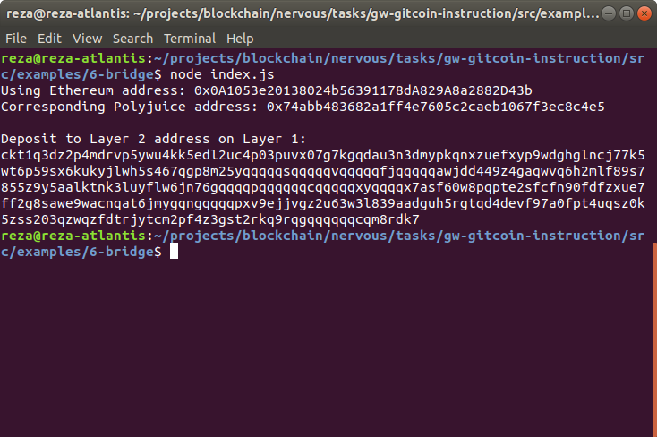

# Gitcoin: 6) Use Force Bridge to Deposit Tokens From Ethereum to Polyjuice

## 1. A screenshot of the console output immediately after you have successfully generated your Deposit Receiver Address. 

## 2. Your Deposit Receiver Address (in text format).
Deposit to Layer 2 address on Layer 1: 
`ckt1q3dz2p4mdrvp5ywu4kk5edl2uc4p03puvx07g7kgqdau3n3dmypkqnxzuefxyp9wdghglncj77k5wt6p59sx6kukyjlwh5s467qgp8m25yqqqqqsqqqqqvqqqqqfjqqqqqawjdd449z4gaqwvq6h2mlf89s7855z9y5aalktnk3luyflw6jn76gqqqqpqqqqqqcqqqqqxyqqqqx7asf60w8pqpte2sfcfn90fdfzxue7ff2g8sawe9wacnqat6jmygqngqqqqpxv9ejjvgz2u63w3l839aadguh5rgtqd4devf97a0fpt4uqsz0k5zss203qzwqzfdtrjytcm2pf4z3gst2rkq9rqgqqqqqqcqm8rdk7`

## 3. The Ethereum address used to generate the Deposit Receiver Address (in text format).
Using Ethereum address: `0x0A1053e20138024b56391178dA829A8a2882D43b`
Corresponding Polyjuice address: `0x74abb483682a1ff4e7605c2caeb1067f3ec8c4e5`

## 4. A link to the Etherscan explorer for the successful Force Bridge transaction.
https://rinkeby.etherscan.io/tx/0x271c64f4dd54c952ca35c0befda4d4bb02f2adf319df13cec994b8fe6e0e7f6b

## 5. A link to the Nervos explorer for the successful Force bridge transaction.
https://explorer.nervos.org/aggron/transaction/0x5372789185c7d93a681d28083b158586dc5e557dda7321424c06a1262f6f05b6