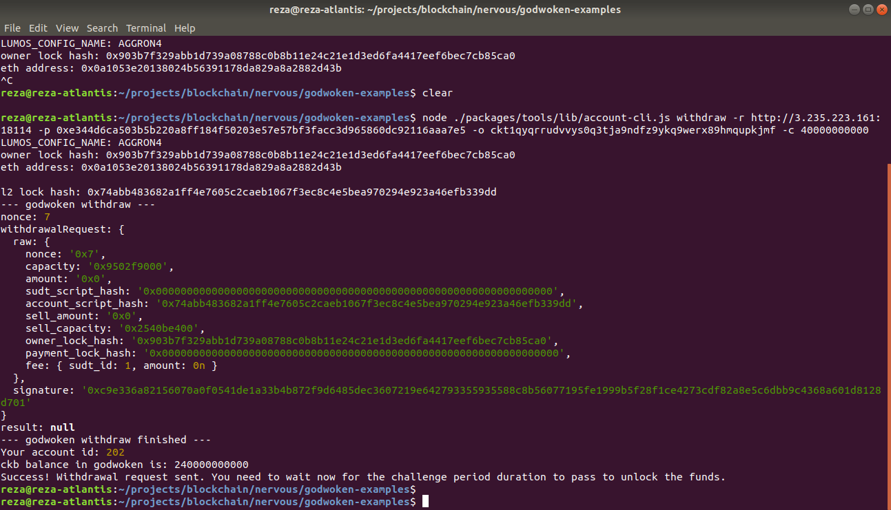

# Gitcoin: 9) Initiate Withdrawal Process from the Layer 2 back to Layer 1

## 1. A screenshot of the console output immediately after running the withdraw command.

## 2. The Ethereum address that you've used for your Layer 2 account (in text format).
eth address: `0x0a1053e20138024b56391178da829a8a2882d43b`

## 3. The Nervos Layer 1 address that you passed to withdraw command (in text format).
`ckt1qyqrrudvvys0q3tja9ndfz9ykq9werx89hmqupkjmf`

